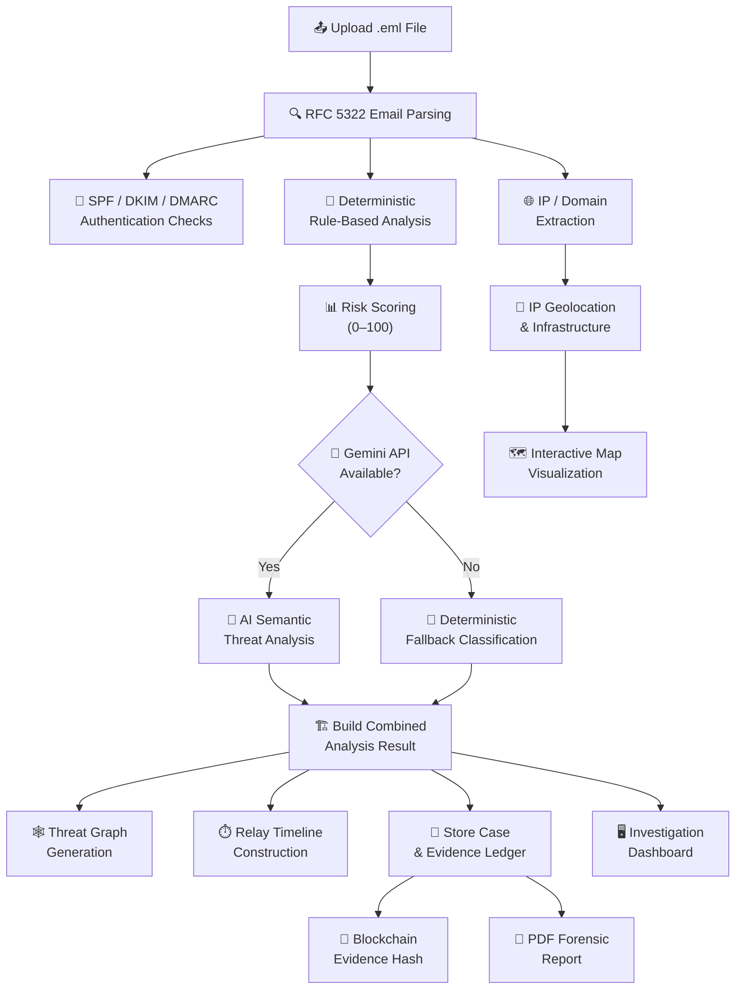
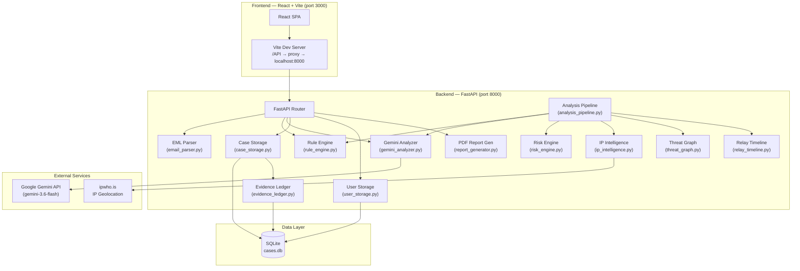

<div align="center">

# 🛡️ AI-Powered Email Threat Detection, GeoLocation & Forensic Intelligence Platform

### Smart India Hackathon 2026 — Problem Statement: SIH26106

**An end-to-end forensic intelligence platform that parses `.eml` email files, performs AI-powered threat analysis, maps infrastructure geolocation, maintains blockchain-style evidence integrity, and presents everything through a professional investigation dashboard.**

---

[](https://python.org)
[](https://fastapi.tiangolo.com)
[](https://react.dev)
[](https://vitejs.dev)
[](https://sqlite.org)
[](https://ai.google.dev)

</div>

---

## 📖 Overview

Email-based cyber threats — phishing, business email compromise, malware delivery, impersonation — remain one of the most prevalent attack vectors worldwide. Investigating suspicious emails requires correlating email headers, authentication results, URL patterns, IP infrastructure, and sender behavior — a process that is typically manual, time-consuming, and error-prone.

This platform **automates the entire email forensic investigation workflow**:

1. **Upload** a raw `.eml` email file
2. **Parse** RFC 5322 headers, metadata, attachments, and body content
3. **Authenticate** SPF, DKIM, and DMARC results
4. **Detect** threat indicators using deterministic rule matching
5. **Analyze** semantic threat context via Google Gemini AI
6. **Score** risk on a 0–100 scale with LOW / MEDIUM / HIGH classification
7. **Extract** IOCs — URLs, domains, IP addresses
8. **Geolocate** infrastructure and visualize on an interactive map
9. **Graph** entity relationships (Email → Sender → Domain → IP → Location)
10. **Preserve** evidence integrity through a blockchain-style SHA-256 ledger
11. **Report** with professional forensic PDF generation

Built for **security analysts, SOC teams, incident responders, and digital forensic investigators** who need fast, explainable, and evidence-backed email threat triage.

---

## ✨ Key Features

| Category | Feature |
|----------|---------|
| **Email Parsing** | Full RFC 5322 EML parsing — headers, bodies, attachments, MIME parts |
| **Threat Detection** | Deterministic rule engine matching 15+ threat indicator patterns |
| **AI Analysis** | Google Gemini-powered semantic threat classification and reasoning |
| **Risk Scoring** | Reproducible 0–100 risk score with LOW / MEDIUM / HIGH levels |
| **Classification** | LEGITIMATE, SUSPICIOUS, PHISHING, IMPERSONATION, BEC, MALWARE |
| **Confidence** | AI-backed or deterministic evidence-based confidence estimation |
| **Authentication** | SPF, DKIM, DMARC verification from email headers |
| **IOC Extraction** | URLs, domains, IP addresses, suspicious patterns |
| **IP Intelligence** | Public IP geolocation via ipwho.is — ISP, ASN, coordinates |
| **Interactive Map** | Leaflet.js infrastructure geolocation visualization |
| **Threat Graph** | Entity relationship graph — Email, Sender, Domain, IP, Location |
| **Relay Timeline** | Chronological SMTP relay hop reconstruction from Received headers |
| **Evidence Ledger** | Append-only SHA-256 blockchain-style forensic evidence chain |
| **Evidence Verification** | Tamper-detection verification against chained hash ledger |
| **PDF Reports** | Professional forensic PDF reports for each investigation case |
| **Case Management** | Full CRUD — create, list, view, delete investigation cases |
| **Dashboard** | Real-time case statistics — total, high/medium/low risk counts |
| **Threat Intel** | Cross-case IOC aggregation — domains, IPs, infrastructure |
| **Authentication** | User registration, login, admin approval workflow |
| **Admin Controls** | User management — approve, reject, delete user accounts |
| **Role-Based Access** | ADMIN (full authority) and USER roles with protected routes |

---

## ⚙️ How It Works



---

## 🏗️ System Architecture



---

## 🛠️ Technology Stack

| Layer | Technology | Purpose |
|-------|-----------|---------|
| **Backend Framework** | FastAPI 0.115+ | Async REST API with automatic OpenAPI docs |
| **Backend Language** | Python 3.10+ | Core analysis, parsing, and persistence logic |
| **AI / LLM** | Google Gemini (`gemini-3.6-flash`) | Semantic threat analysis, classification, reasoning |
| **Frontend Framework** | React 18 | Interactive investigation dashboard SPA |
| **Build Tool** | Vite 6 | Fast development server and production builds |
| **UI Components** | Lucide React | Consistent icon system throughout the interface |
| **Mapping** | Leaflet.js 1.9 | Interactive infrastructure geolocation map tiles |
| **Map Tiles** | OpenStreetMap | Free, open-source geographic tile layer |
| **Database** | SQLite 3 | Lightweight file-based persistence for cases and users |
| **Data Validation** | Pydantic v2 | Schema validation, serialization, and type safety |
| **PDF Generation** | ReportLab | Professional A4 forensic report generation |
| **IP Geolocation** | ipwho.is | Free IP intelligence — location, ISP, ASN |
| **Testing** | pytest | Backend unit and integration test suite |
| **Environment** | python-dotenv | Secure API key management via `.env` files |

---

## 📁 Project Structure

```text
sih2026-email-forensics/
├── backend/
│   ├── app/
│   │   ├── ai/
│   │   │   ├── __init__.py
│   │   │   └── gemini_analyzer.py      # Google Gemini semantic analysis
│   │   ├── __init__.py
│   │   ├── analysis_pipeline.py         # Composes all analysis layers
│   │   ├── case_storage.py              # SQLite case persistence + CRUD
│   │   ├── confidence_engine.py         # Evidence-based confidence estimation
│   │   ├── email_parser.py              # RFC 5322 EML parsing engine
│   │   ├── evidence_ledger.py           # SHA-256 blockchain evidence chain
│   │   ├── indicators.py                # Threat pattern definitions
│   │   ├── ip_intelligence.py           # IP geolocation + DNS resolution
│   │   ├── main.py                      # FastAPI application + routes
│   │   ├── relay_timeline.py            # SMTP relay hop reconstruction
│   │   ├── report_generator.py          # PDF forensic report generation
│   │   ├── risk_engine.py               # Risk scoring + level classification
│   │   ├── rule_engine.py               # Deterministic threat rule matching
│   │   ├── schemas.py                   # Pydantic models + API schemas
│   │   ├── threat_graph.py              # Entity relationship graph builder
│   │   └── user_storage.py              # User auth, roles, admin management
│   ├── data/
│   │   └── cases.db                     # SQLite database (gitignored)
│   ├── tests/
│   │   ├── test_analysis_pipeline.py
│   │   ├── test_case_storage.py
│   │   ├── test_confidence_engine.py
│   │   ├── test_email_parser.py
│   │   ├── test_evidence_ledger.py
│   │   ├── test_gemini_analyzer.py
│   │   ├── test_ip_intelligence.py
│   │   ├── test_pdf_reports.py
│   │   ├── test_relay_timeline.py
│   │   ├── test_risk_presentation.py
│   │   ├── test_rule_engine.py
│   │   └── test_threat_graph.py
│   ├── .env.example
│   ├── requirements.txt
│   └── README.md
├── frontend/
│   ├── src/
│   │   ├── components/
│   │   │   ├── AISemanticAnalysisView.jsx   # AI analysis display
│   │   │   ├── Badge.jsx                    # Risk/classification badges
│   │   │   ├── BlockchainLedgerView.jsx     # Evidence chain + verification UI
│   │   │   ├── GeoMap.jsx                   # Leaflet map component
│   │   │   ├── Header.jsx                   # Top navigation header
│   │   │   ├── Sidebar.jsx                  # Navigation sidebar
│   │   │   └── ThreatGraphView.jsx          # Threat graph visualization
│   │   ├── pages/
│   │   │   ├── AdminUserManagementPage.jsx  # Admin user approval panel
│   │   │   ├── CasesPage.jsx                # Case list + forensic detail modal
│   │   │   ├── DashboardPage.jsx            # Overview metrics + recent cases
│   │   │   ├── InvestigateEmailPage.jsx     # EML upload + full analysis view
│   │   │   ├── LoginPage.jsx                # User authentication
│   │   │   ├── RegisterPage.jsx             # User registration
│   │   │   ├── ReportsPage.jsx              # PDF report download page
│   │   │   └── ThreatIntelPage.jsx          # Cross-case IOC intelligence
│   │   ├── api.js                           # Backend API client functions
│   │   ├── App.jsx                          # Root application + routing
│   │   ├── App.css                          # Application styles
│   │   ├── index.css                        # Global styles
│   │   └── main.jsx                         # React entry point
│   ├── index.html
│   ├── package.json
│   └── vite.config.js
├── dataset/
│   ├── EMAIL-001.eml ... EMAIL-012.eml      # Sample investigation emails
│   └── phishing and benign email dataset.jsonl  # Training/test dataset
├── demo emails/
│   ├── DEMO-01-LEGITIMATE-MEETING.eml
│   ├── DEMO-02-LEGITIMATE-ORDER.eml
│   ├── DEMO-03-PHISHING-ACCOUNT.eml
│   ├── DEMO-04-MALWARE-ATTACHMENT.eml
│   ├── DEMO-05-SUSPICIOUS-LOGIN.eml
│   ├── high_risk_test.eml
│   └── test_phishing.eml
├── .gitignore
└── README.md
```

---

## 🤖 AI / Threat Analysis

The platform uses a **dual-layer analysis architecture** combining deterministic rules with AI-powered semantic reasoning.

### Layer 1: Deterministic Rule Engine

The rule engine (`rule_engine.py`) matches parsed email evidence against fixed patterns:

| Category | Indicators Detected | Score Weight |
|----------|-------------------|-------------|
| **Authentication** | SPF failure, DKIM failure, DMARC failure | 15–20 pts |
| **Address Mismatch** | Reply-To domain mismatch, Sender/Return-Path mismatch | 10–12 pts |
| **URL Patterns** | Suspicious URLs, HTTP-only links, URL shorteners | 12 pts |
| **Domain Patterns** | IDN homograph attacks, excessive hyphens, numeric-heavy labels | 10 pts |
| **Content Analysis** | Credential requests, payment language, BEC cues, urgency/social engineering | 8–18 pts |
| **Attachments** | Executable extensions (.exe, .bat, .ps1, .vbs, etc.) | 18 pts |
| **Impersonation** | Display-name spoofing of CEO, CFO, IT Support, etc. | 12 pts |

### Layer 2: Gemini AI Semantic Analysis

When `GEMINI_API_KEY` is configured, the parsed email evidence is sent to Google Gemini (`gemini-3.6-flash`) with a structured prompt:

- **Input**: Sender info, subject, body, URLs, domains, SPF/DKIM/DMARC results, deterministic indicators
- **Output**: Structured JSON with classification, confidence, explanation, recommended action, threat categories
- **Safety**: The prompt is evidence-only — untrusted email text cannot redefine the analysis task

### Risk Scoring

```
Risk Score = Σ (indicator.score_contribution), bounded to [0, 100]

Score Range → Risk Level:
  0 – 49  → LOW
 50 – 74  → MEDIUM
 75 – 100 → HIGH
```

### Confidence Estimation

- **With AI**: Confidence comes directly from Gemini's semantic assessment
- **Without AI**: A deterministic evidence-consistency estimator provides fallback confidence based on classification base rates, indicator count, and risk score

### Classification Categories

| Category | Description |
|----------|------------|
| `LEGITIMATE` | No threat indicators detected |
| `SUSPICIOUS` | Minor anomalies or ambiguous patterns |
| `PHISHING` | Credential harvesting or social engineering detected |
| `IMPERSONATION` | Display-name or domain spoofing detected |
| `BUSINESS_EMAIL_COMPROMISE` | BEC patterns with financial language |
| `MALWARE` | Suspicious executable attachments detected |

---

## 🔗 Forensic Evidence Handling

### Evidence Ledger

Every stored case generates a **blockchain-style evidence block** using SHA-256 hashing:

- **Evidence Hash**: Deterministic SHA-256 of case metadata, risk assessment, classification, senders, recipients, IPs, URLs, infrastructure data, and AI analysis
- **Block Hash**: SHA-256 of block index, case ID, evidence hash, timestamp, and previous block hash
- **Chain Linkage**: Each block references the previous block's hash, creating a tamper-evident chain starting from a `GENESIS` block

### Evidence Verification

The verification endpoint (`GET /api/cases/{case_id}/blockchain/verify`) performs:

1. Recomputes the evidence hash from current stored case data
2. Compares against the originally recorded evidence hash
3. Validates the entire chain from GENESIS to the requested block
4. Returns verified: true/false with explanatory message

### Audit Trail

| Field | Purpose |
|-------|---------|
| Block index | Sequential position in the ledger |
| Case ID | Links block to investigation case |
| Evidence hash | SHA-256 fingerprint of case evidence |
| Timestamp | UTC creation time of the block |
| Previous hash | Chain linkage to prior block |
| Current hash | SHA-256 of this block's immutable contents |

---

## 🌍 Geolocation & Threat Intelligence

### IP Infrastructure Lookup

Public IPv4 addresses observed in emails are resolved via [ipwho.is](https://ipwho.is):

| Data Point | Source |
|-----------|--------|
| Country, Region, City | IP geolocation provider |
| Latitude / Longitude | IP geolocation provider |
| ISP | Connection metadata |
| ASN | Autonomous System Number |
| Organization | ASN organization name |

### Address Classification

All IPv4 addresses are classified locally before any external lookup:

| Class | Description |
|-------|------------|
| `public` | Global unicast — eligible for geolocation |
| `private` | RFC 1918 — not externally resolvable |
| `reserved` | Multicast, loopback, link-local |
| `documentation` | RFC 5737 test networks (192.0.2.x, 198.51.100.x, 203.0.113.x) |
| `invalid` | Malformed or non-IPv4 |

### Map Visualization

Interactive Leaflet.js maps display infrastructure geolocation with:

- OpenStreetMap tile layer
- Marker with popup showing IP, city, country, coordinates, ISP
- Proper disclaimer: *"Infrastructure geolocation identifies probable network infrastructure, not an attacker's physical location."*

### Threat Graph

Entity relationship graphs are built from email evidence:

```
EMAIL → sent_by → SENDER
EMAIL → replies_to → REPLY_TO
EMAIL → references_domain → DOMAIN
EMAIL → contains_url → URL
EMAIL → contains_ip → IP
URL → hosted_on → DOMAIN
DOMAIN → resolved_or_relayed_to → IP
IP → probable_infrastructure_location → LOCATION
```

---

## 👥 User Roles & Security

### Authentication System

| Feature | Implementation |
|---------|---------------|
| Registration | Username + email + password → status `PENDING` |
| Login | Username/email + password authentication |
| Approval | Admin must approve new registrations |
| Password Storage | SHA-256 hashed with salt |
| Session | Browser sessionStorage-based auth state |

### User Roles

| Role | Permissions |
|------|------------|
| **ADMIN** | Full authority — view all users, approve/reject/delete accounts, all platform features |
| **USER** | Email investigation, case management, threat intel, reports (after approval) |

### Admin Controls

- **List** all registered users with status
- **Approve** pending user registrations
- **Reject** suspicious registrations
- **Delete** user accounts (cannot self-delete)
- Admin panel only visible to ADMIN role users
- Default admin account seeded on first startup

---

## 🚀 Installation & Setup

### Prerequisites

- **Python 3.10+** (with `pip`)
- **Node.js 18+** (with `npm`)
- **Google Gemini API Key** (optional — for AI semantic analysis)

### 1. Clone the Repository

```bash
git clone https://github.com/your-team/sih2026-email-forensics.git
cd sih2026-email-forensics
```

### 2. Backend Setup

```bash
cd backend

# Create virtual environment
python -m venv .venv

# Activate (Windows)
.venv\Scripts\activate

# Activate (macOS/Linux)
source .venv/bin/activate

# Install dependencies
pip install -r requirements.txt

# Configure environment variables
cp .env.example .env
# Edit .env and add your GEMINI_API_KEY
```

### 3. Start Backend Server

```bash
cd backend
uvicorn app.main:app --reload --host 0.0.0.0 --port 8000
```

The API is now available at `http://localhost:8000` with interactive docs at `http://localhost:8000/docs`.

### 4. Frontend Setup

```bash
cd frontend

# Install dependencies
npm install

# Start development server
npm run dev
```

The frontend is now available at `http://localhost:3000`. It automatically proxies `/api` requests to the backend at port 8000.

### 5. Build for Production

```bash
cd frontend
npm run build    # Output in frontend/dist/
```

---

## 🔑 Environment Variables

Create `backend/.env` from the template:

```env
# Google Gemini API key for semantic threat analysis.
# Optional — deterministic analysis works without it.
# Never commit the real key or expose it to clients.
GEMINI_API_KEY=your_gemini_api_key_here
```

> **Security Note**: The `.env` file is gitignored. Never place API keys in frontend code, commit them to version control, or expose them through API responses.

---

## 📡 API Reference

### Analysis

| Method | Endpoint | Description |
|--------|----------|-------------|
| `POST` | `/api/analyze` | Upload `.eml` file → full analysis pipeline |
| `POST` | `/api/cases` | Store analysis as a persistent case |
| `GET` | `/api/cases` | List all stored cases (newest first) |
| `GET` | `/api/cases/{case_id}` | Get full case details |
| `DELETE` | `/api/cases/{case_id}` | Delete a specific case |
| `DELETE` | `/api/cases` | Delete all stored cases |

### Forensic Reports

| Method | Endpoint | Description |
|--------|----------|-------------|
| `GET` | `/api/reports/{case_id}/pdf` | Download forensic PDF report |

### Blockchain Evidence

| Method | Endpoint | Description |
|--------|----------|-------------|
| `GET` | `/api/cases/{case_id}/blockchain/verify` | Verify case evidence integrity |
| `GET` | `/api/blockchain` | List all evidence ledger blocks |

### Authentication & Admin

| Method | Endpoint | Description |
|--------|----------|-------------|
| `POST` | `/api/auth/register` | Register new user account |
| `POST` | `/api/auth/login` | Authenticate user credentials |
| `GET` | `/api/admin/users` | List all registered users (admin) |
| `POST` | `/api/admin/users/{user_id}/approve` | Approve user (admin) |
| `POST` | `/api/admin/users/{user_id}/reject` | Reject user (admin) |
| `DELETE` | `/api/admin/users/{user_id}` | Delete user (admin) |

### Health

| Method | Endpoint | Description |
|--------|----------|-------------|
| `GET` | `/api/health` | Backend health check |

Full interactive API documentation is available at **`http://localhost:8000/docs`** (Swagger UI).

---

## 🧪 Testing

### Run All Tests

```bash
cd backend
python -m pytest -q
```

### Test Coverage

The test suite covers **70+ tests** across 12 test modules:

| Test File | Area Covered |
|-----------|-------------|
| `test_email_parser.py` | EML parsing, header extraction, URL/IP/address detection |
| `test_rule_engine.py` | Deterministic threat indicator matching |
| `test_risk_presentation.py` | Risk scoring, level thresholds (35→LOW, 50→MEDIUM, 75→HIGH) |
| `test_confidence_engine.py` | Confidence estimation with/without AI |
| `test_analysis_pipeline.py` | End-to-end analysis composition |
| `test_gemini_analyzer.py` | Gemini API interaction and prompt construction |
| `test_ip_intelligence.py` | IP classification, geolocation, DNS fallback |
| `test_threat_graph.py` | Graph node/edge generation from email evidence |
| `test_relay_timeline.py` | Received header timeline reconstruction |
| `test_evidence_ledger.py` | SHA-256 hashing, chain integrity, block verification |
| `test_case_storage.py` | Case CRUD, AI analysis persistence, risk level derivation |
| `test_pdf_reports.py` | PDF generation from stored cases |

### Risk Level Threshold Verification

```
Risk Score 35  → LOW    ✅
Risk Score 49  → LOW    ✅
Risk Score 50  → MEDIUM ✅
Risk Score 74  → MEDIUM ✅
Risk Score 75  → HIGH   ✅
Risk Score 100 → HIGH   ✅
```

---

## 📧 Sample / Demo Data

The repository includes ready-to-use demo email files in the `demo emails/` directory:

| File | Type | Description |
|------|------|-------------|
| `DEMO-01-LEGITIMATE-MEETING.eml` | Benign | Legitimate meeting invitation |
| `DEMO-02-LEGITIMATE-ORDER.eml` | Benign | Legitimate order confirmation |
| `DEMO-03-PHISHING-ACCOUNT.eml` | Phishing | Account verification phishing attempt |
| `DEMO-04-MALWARE-ATTACHMENT.eml` | Malware | Email with suspicious executable attachment |
| `DEMO-05-SUSPICIOUS-LOGIN.eml` | Suspicious | Suspicious login notification |
| `high_risk_test.eml` | High Risk | Synthetic high-risk phishing test |
| `test_phishing.eml` | Phishing | Test phishing email with indicators |

Additional test emails are available in the `dataset/` directory.

**To demonstrate the platform**: Upload any `.eml` file via the Investigate Email page and observe the full analysis pipeline in action.

---

## 📸 Screenshots

> *Add screenshots of your running application here*

### Dashboard
*Screenshot: Dashboard overview with case statistics and recent investigations*

### Email Investigation
*Screenshot: EML upload form with full analysis results — risk assessment, authentication, indicators, AI analysis*

### GeoLocation Map
*Screenshot: Interactive Leaflet map showing infrastructure geolocation with IP and ISP details*

### Case Investigation
*Screenshot: Forensic case detail modal with all sections — risk, AI analysis, metadata, blockchain verification*

### Threat Graph
*Screenshot: Entity relationship visualization — Email → Sender → Domain → IP → Location*

### Blockchain Evidence
*Screenshot: Evidence integrity verification and ledger chain visualization*

---

## 🎯 Use Cases

| Use Case | Description |
|----------|------------|
| **Phishing Investigation** | Upload suspicious emails to identify phishing indicators, credential harvesting links, and spoofed sender domains |
| **Malware Triage** | Detect malicious attachments by extension analysis and sandbox-oriented IOC extraction |
| **BEC Detection** | Identify business email compromise patterns combining payment language with impersonation cues |
| **SOC Analyst Workflow** | Rapid email threat triage with risk scoring, classification, and recommended actions |
| **Incident Response** | Generate forensic PDF reports with full evidence chain for incident documentation |
| **Digital Forensics** | Maintain blockchain-style evidence integrity for legally defensible investigation trails |
| **Threat Intelligence** | Aggregate IOCs across multiple cases to identify patterns and infrastructure overlap |
| **Security Training** | Demonstrate real email threat patterns using the demo email collection |

---

## 💡 Advantages

| Advantage | Benefit |
|-----------|---------|
| **Automation** | Replaces manual header analysis with automated multi-layer parsing |
| **Dual-Layer Analysis** | Deterministic rules ensure reproducibility; AI adds contextual reasoning |
| **Explainable Results** | Every indicator includes severity, explanation, and score contribution |
| **Evidence Integrity** | SHA-256 blockchain ledger ensures tamper-evident forensic trails |
| **Centralized Investigation** | All case data, analysis, and reports in one platform |
| **Geographic Intelligence** | Infrastructure geolocation reveals network-level infrastructure location |
| **Risk Prioritization** | Clear 0–100 scoring with LOW/MEDIUM/HIGH triage levels |
| **PDF Reporting** | Professional forensic reports ready for documentation and handoff |
| **Graceful Degradation** | Works with or without Gemini API — deterministic analysis always available |

---

## 🔮 Future Enhancements

- [ ] **Advanced ML Models** — Train custom phishing/malware classifiers on labeled email datasets
- [ ] **Real-Time Email Monitoring** — IMAP/SMTP integration for continuous inbox monitoring
- [ ] **SIEM Integration** — Export IOCs and alerts to Splunk, ELK, or Microsoft Sentinel
- [ ] **Automated IOC Enrichment** — VirusTotal, AbuseIPDB, and Shodan integration for IP/domain reputation
- [ ] **Multi-Language Support** — Parse and analyze emails in non-English languages
- [ ] **Email Attachment Sandboxing** — Automated detonation and behavioral analysis of suspicious attachments
- [ ] **Case Collaboration** — Multi-investigator case assignment and annotation
- [ ] **API Rate Limiting** — Throttling and quota management for production deployment
- [ ] **Docker Deployment** — Containerized deployment with docker-compose
- [ ] **Email Chain Analysis** — Thread reconstruction across multiple related emails
- [ ] **Custom Rule Builder** — UI for creating organization-specific detection rules
- [ ] **Export Formats** — STIX/TAXII, CSV, and JSON export for IOCs and case data

---

## 👥 Team

| Role | Name |
|------|------|
| *Team Member 1* | *Manogna Nerella* |
| *Team Member 2* | *Ananditha G* |
| *Team Member 3* | *Isaac E* |
| *Team Member 4* | *Nandakumar G* |
| *Team Member 5* | *P Aakash* |
| *Team Member 6* | *Mohamed Faizon* |

> *Replace placeholders with actual team member information.*

---

## 🤝 Contributing

This project was developed for Smart India Hackathon 2026. Contributions, issues, and feature requests are welcome.

1. Fork the repository
2. Create a feature branch (`git checkout -b feature/your-feature`)
3. Commit changes (`git commit -m 'Add your feature'`)
4. Push to branch (`git push origin feature/your-feature`)
5. Open a Pull Request

Please ensure all existing tests pass before submitting:

```bash
cd backend && python -m pytest -q
cd frontend && npm run build
```

---

## 📄 License

This project does not currently specify a license. Please contact the team for usage permissions.

---

## 🙏 Acknowledgements

- **Smart India Hackathon 2026** — Problem Statement SIH26106
- **Google Gemini AI** — Semantic threat analysis capabilities
- **FastAPI** — High-performance Python web framework
- **React** — Frontend UI library
- **Leaflet.js** — Interactive mapping library
- **OpenStreetMap** — Free map tile provider
- **ipwho.is** — Free IP geolocation service
- **ReportLab** — Python PDF generation library
- **Lucide** — Open-source icon library

---

<div align="center">

**Built for Smart India Hackathon 2026**

Problem Statement: **SIH26106** — AI-Powered Email Threat Detection, GeoLocation and Forensic Intelligence Platform

</div>
